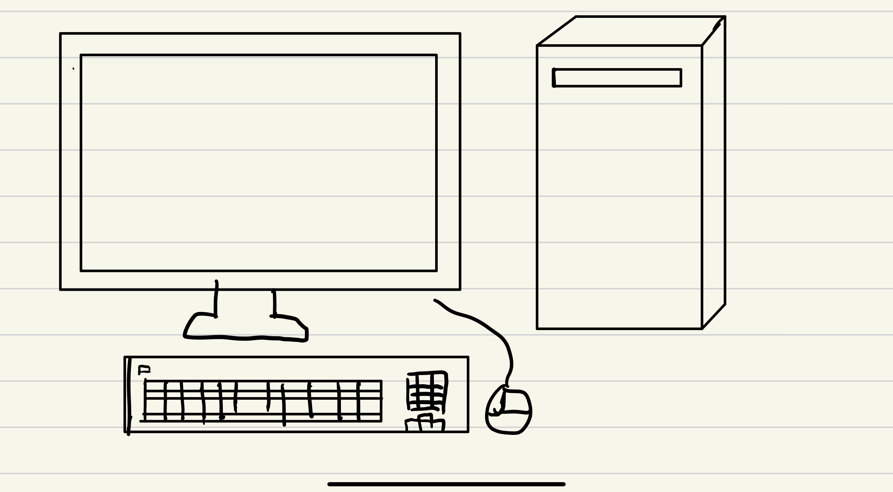

# Lesson No 2: working with gitub markdown(.md) files

A markdown file is a text file with special formating. These file have extension .md

## My first picture of the computer

**Fig. 1** My first try at drawing a computer

In **Fig. 1** I tried to draw a computer and I could draw only the outside of the computer. I think I will learn more about its interior and its function. Next time, I will try to show both the inside and outside structure of the computre.

# title
## subtitle
### smaller title
**bold**

